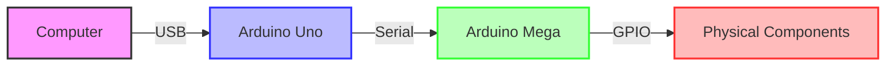

# 🎮 Digital Bingo System

<div align="center">


[](https://github.com/1ordo/bingo-game/issues)

</div>

> A hybrid digital/physical bingo system that combines software and hardware for an interactive gaming experience. Control real-world ball drawing mechanisms through a beautiful digital interface.

## ✨ Features

<table>
  <tr>
    <td>
      <h3>🎲 Game Features</h3>
      <ul>
        <li>Dynamic 5x5 card generation</li>
        <li>Multiple winning patterns</li>
        <li>Score tracking & statistics</li>
        <li>Customizable game settings</li>
      </ul>
    </td>
    <td>
      <h3>🎛️ Hardware Integration</h3>
      <ul>
        <li>Physical ball drawing system</li>
        <li>Arduino-powered mechanics</li>
        <li>Auto-detection of hardware</li>
        <li>Simulation mode fallback</li>
      </ul>
    </td>
    <td>
      <h3>🔊 Multimedia</h3>
      <ul>
        <li>Immersive sound effects</li>
        <li>Background music</li>
        <li>High-quality ball visuals</li>
        <li>Responsive vertical display</li>
      </ul>
    </td>
  </tr>
</table>

## 🗂️ Project Structure

```
📁 Root
├── 📄 main.py                  # Main game entrypoint
├── 📄 settings.json            # Game configuration
├── 📄 requirements.txt         # Python dependencies
├── 📁 Arduino_scripts/         # Hardware control code
│   ├── 📄 Mega.ino             # Arduino Mega controller
│   └── 📄 uno.ino              # Arduino Uno bridge
└── 📁 assets/                  # Game assets
    ├── 📁 fonts/               # Typography 
    ├── 📁 images/              # Graphics & sprites
    └── 📁 sounds/              # Audio files
```

## 🚀 Getting Started

### 📋 Requirements

- 🐍 Python 3.6+
- 🎮 Pygame
- 📡 PySerial
- 🔌 Arduino Uno (connected to computer)
- 🎛️ Arduino Mega (connected to physical components)

### 🔧 Hardware Setup

<details>
<summary>Click to expand hardware instructions</summary>

1. Connect the Arduino Uno to your computer via USB
   - This Uno acts as the bridge between your computer and the Mega
   - If the Uno is not connected, the game will run in simulation mode

2. Connect the Arduino Mega to the physical bingo components
   - The Mega controls all the physical elements (ball lift, shutter, etc.)

3. Connect the Arduino Uno and Mega together:
   - Uno RX (pin 10) → Mega TX
   - Uno TX (pin 11) → Mega RX
   - Connect GND between both Arduinos (common ground)

</details>

### 🎛️ Arduino Mega Hardware Details

<details>
<summary>Click to expand Arduino Mega specifications and wiring</summary>

The Arduino Mega is the heart of the physical bingo machine, controlling all mechanical components through its numerous I/O pins.

#### Components Controlled by the Mega

| Component | Function | Pin Connections |
|-----------|----------|----------------|
| Ball Lift Motor | Raises balls to the top of the mechanism | Motor Driver A - pins 22, 24 |
| Ball Gate Servo | Controls ball release into the drawing tube | Servo pin 9 |
| Ball Detection Sensors | Identifies which ball has been drawn | Analog pins A0-A15 |
| Return Path Stepper | Returns balls to the storage area | Stepper Driver - pins 30, 32, 34, 36 |
| LED Display | Shows drawn ball numbers | Shift Register - pins 40, 42, 44 |
| Status LEDs | Indicates system state | pins 50, 52, 53 |

#### Wiring Diagram

```
                                           ┌─────────────┐
                                           │             │
                                           │ BALL SENSOR │
                                           │   ARRAY     │
                                           │             │
                                           └──────┬──────┘
                                                  │
                                                  ▼
┌───────────────┐          ┌──────────────┐    ┌─────┐    ┌──────────────┐
│               │          │              │    │     │    │              │
│   COMPUTER    │◄────────►│ ARDUINO UNO  │◄──►│MEGA │◄──►│ MOTOR DRIVER │
│               │  USB     │   (Bridge)   │    │     │    │  CIRCUITS    │
└───────────────┘          └──────────────┘    └─────┘    └──────────────┘
                                                  │
                                                  ▼
                                           ┌──────────────┐
                                           │              │
                                           │  LED DISPLAY │
                                           │              │
                                           └──────────────┘
```

#### Pin Configuration

| Pin Group | Purpose |
|-----------|---------|
| Digital 0-1 | Serial communication with Arduino Uno |
| Digital 2-8 | Ball identification LEDs |
| Digital 9 | Ball release servo control |
| Digital 22-29 | Ball lift motor control |
| Digital 30-37 | Return mechanism stepper control |
| Digital 40-45 | Display control via shift registers |
| Digital 50-53 | Status indicator LEDs |
| Analog A0-A15 | Ball color/number sensors |

#### Power Requirements

The Arduino Mega requires external power for driving the motors and mechanisms:
- 12V 2A power supply for the Arduino Mega
- 5V logic level for sensors and communication
- Separate 12V 5A power supply for high-current motors

</details>

### 🔄 Communication Protocol

The game uses a simple serial protocol to control hardware:

| Command | Function |
|---------|----------|
| **N**   | Start new game |
| **E**   | End current game |
| **D**   | Draw a new ball |

### 📊 Connection Diagram



### 💻 Software Setup

<details>
<summary>Click to expand setup instructions</summary>

1. Clone this repository:
   ```bash
   git clone https://github.com/1ordo/bingo-game.git
   cd bingo-game
   ```

2. Create a virtual environment and activate it:
   ```bash
   python -m venv .venv
   
   # On Windows
   .\.venv\Scripts\activate
   
   # On macOS/Linux
   source .venv/bin/activate
   ```

3. Install required Python packages:
   ```bash
   pip install -r requirements.txt
   ```

4. Upload the Arduino code:
   - Upload the `Arduino_scripts/uno.ino` script to the Arduino Uno
   - Upload the `Arduino_scripts/Mega.ino` script to the Arduino Mega

5. Configure the `settings.json` file with the correct serial port or enable auto-detection

</details>

## 🎮 Running the Game

Start the game with:
```bash
python main.py
```

### 🔍 Finding Your Arduino Port

| OS | Port Pattern |
|----|--------------|
| macOS | `/dev/tty.usbmodem*` or `/dev/tty.usbserial*` |
| Windows | `COM*` (ex: COM3, COM4) |
| Linux | `/dev/ttyACM*` or `/dev/ttyUSB*` |

### 🎲 Game Controls

| Key | Action |
|-----|--------|
| **Space** | Draw a new ball (manual mode) |
| **ESC** | Return to main menu |
| **Arrow Keys** | Navigate menus |
| **Enter** | Select menu option |

## ⚙️ Configuration

The game can be configured through the Settings menu:

- **🔌 Serial Settings**: Arduino connection configuration
- **🖥️ Display Settings**: Screen resolution and fullscreen options
- **🔊 Audio Settings**: Music and sound effects volume
- **🎲 Game Settings**: Ball draw speed and winning patterns

## 🎯 How to Play

1. Launch the game
2. Select "New Game" from the main menu
3. A new bingo card will be generated
4. Balls will be automatically drawn at regular intervals
5. Match the numbers on your card with the drawn balls
6. Get 5 in a row (horizontally, vertically, or diagonally) to win!

## 👨‍💻 Development

This project is under active development with plans for enhanced animations and UI improvements. See the [CHANGELOG](CHANGELOG.md) for version history and upcoming features.

<div align="center">

[](CONTRIBUTING.md)
[](CHANGELOG.md)

</div>

Contributions are welcome! Please check our [Contributing Guide](CONTRIBUTING.md) for guidelines on making contributions.

## 📄 License

<div align="center">

This project is licensed under the MIT License - see the [LICENSE](LICENSE) file for details.

</div>

## 🙏 Acknowledgements

- 🎨 UI/UX Design: Liphook design team
- 🔊 Sound effects: Various creative commons sources
- 🎲 Game mechanics inspiration: Classic bingo systems